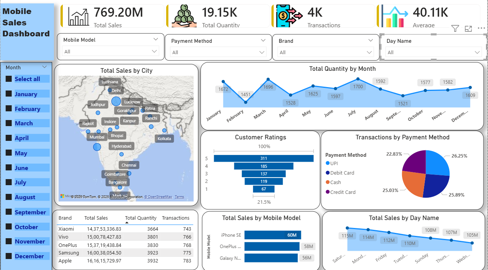

# 📱 Mobile Sales Dashboard (Power BI)

## 📌 Project Overview
This project presents an interactive **Power BI dashboard** analyzing mobile phone sales across India to identify trends, KPIs, and customer behavior.

## 🛠 Tools Used
- Power BI
- Microsoft Excel
- Data Analysis & Visualization

## 📊 Dashboard Features
- Total Sales, Quantity, Transactions & Average Price KPIs
- City-wise sales analysis
- Monthly quantity trend
- Customer rating distribution
- Payment method analysis
- Brand & model performance
- Day-wise sales trends

## 📸 Dashboard Preview

## 🎥 Dashboard Demo Video
[View interactive dashboard here on the Power BI Service]
(https://app.powerbi.com/view?r=eyJrIjoiYjk5MzIyODgtOTRkZS00YjAyLWI1MmEtOGM3ZDVjOTM3NTZlIiwidCI6ImZlNjRlZjQ2LTNjMDUtNGFkMC04OTIwLWNmZmZiMzMyOWNhMSJ9)

## 📂 Dataset
- **File:** Mobile Sales Data.xlsx
- **Type:** Sales transaction data

## 🚀 How to Use
1. Download the repository
2. Open `.pbix` file in Power BI Desktop
3. Refresh data if required

## 👤 Author
**Yash Sonwane**  
Aspiring Data Analyst
